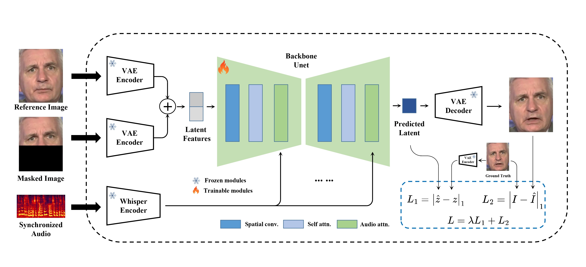

# MuseTalk

MuseTalk: Real-Time High Quality Lip Synchronization with Latent Space Inpainting
</br>
Yue Zhang <sup>\*</sup>,
Minhao Liu<sup>\*</sup>,
Zhaokang Chen,
Bin Wu<sup>†</sup>,
Yingjie He,
Chao Zhan,
Wenjiang Zhou
(<sup>*</sup>Equal Contribution, <sup>†</sup>Corresponding Author, benbinwu@tencent.com)

**[github](https://github.com/TMElyralab/MuseTalk)**    **[huggingface](https://huggingface.co/TMElyralab/MuseTalk)**    **Project(comming soon)**    **Technical report (comming soon)**

We introduce `MuseTalk`, a **real-time high quality** lip-syncing model (30fps+ on an NVIDIA Tesla V100). MuseTalk can be applied with input videos, e.g., generated by [MuseV](https://github.com/TMElyralab/MuseV), as a complete virtual human solution.

# Overview
`MuseTalk` is a real-time high quality audio-driven lip-syncing model trained in the latent space of `ft-mse-vae`, which

1. modifies an unseen face according to the input audio, with a size of face region of `256 x 256`.
1. supports audio in various languages, such as Chinese, English, and Japanese.
1. supports real-time inference with 30fps+ on an NVIDIA Tesla V100.
1. supports modification of the center point of the face region proposes, which **SIGNIFICANTLY** affects generation results. 
1. checkpoint available trained on the HDTF dataset.
1. training codes (comming soon).

# News
- [04/02/2024] Released MuseTalk project and pretrained models.

## Model

MuseTalk was trained in latent spaces, where the images were encoded by a freezed VAE. The audio was encoded by a freezed `whisper-tiny` model. The architecture of the generation network was borrowed from the UNet of the `stable-diffusion-v1-4`, where the audio embeddings were fused to the image embeddings by cross-attention.

## Cases
### MuseV + MuseTalk make human photos alive！
<table class="center">
  <tr style="font-weight: bolder;text-align:center;">
        <td width="33%">Image</td>
        <td width="33%">MuseV </td>
        <td width="33%"> +MuseTalk</td>
  </tr>
  <tr>
    <td>
      
    </td>
    <td >
      <video src=assets/demo/yongen/yongen_musev.mp4 controls preload></video>
    </td>
    <td >
      <video src=assets/demo/yongen/yongen_musetalk.mp4 controls preload></video>
    </td>
  </tr>
  <tr>
    <td>
      
    </td>
    <td >
      <video src=assets/demo/monalisa/monalisa_musev.mp4 controls preload></video>
    </td>
    <td >
      <video src=assets/demo/monalisa/monalisa_musetalk.mp4 controls preload></video>
    </td>
  </tr>
  <tr>
    <td>
      
    </td>
    <td >
      <video src=assets/demo/sun1/sun_musev.mp4 controls preload></video>
    </td>
    <td >
      <video src=assets/demo/sun1/sun_musetalk.mp4 controls preload></video>
    </td>
  </tr>
  <tr>
    <td>
      
    </td>
    <td >
      <video src=assets/demo/sun2/sun_musev.mp4 controls preload></video>
    </td>
    <td >
      <video src=assets/demo/sun2/sun_musetalk.mp4 controls preload></video>
    </td>
  </tr>
</table >

* The character of the last two rows, `Xinying Sun`, is a supermodel KOL. You can follow her on [douyin](https://www.douyin.com/user/MS4wLjABAAAAWDThbMPN_6Xmm_JgXexbOii1K-httbu2APdG8DvDyM8).

## Video dubbing
<table class="center">
  <tr style="font-weight: bolder;text-align:center;">
        <td width="70%">MuseTalk</td>
        <td width="30%">Original videos</td>
  </tr>
  <tr>
    <td>
      <video src=assets/demo/video_dubbing/Let_the_Bullets_Fly.mp4 controls preload></video>
    </td>
    <td>
      <a href="//www.bilibili.com/video/BV1wT411b7HU">Link</a>
      <href src=""></href>
    </td>
  </tr>
</table>

* For video dubbing, we applied a self-developed tool which can detect the talking person. 


# TODO:
- [x] trained models and inference codes.
- [ ] technical report.
- [ ] training codes.
- [ ] online UI.
- [ ] a better model (may take longer).


# Getting Started
We provide a detailed tutorial about the installation and the basic usage of MuseTalk for new users:
## Installation
To prepare the Python environment and install additional packages such as opencv, diffusers, mmcv, etc., please follow the steps below:
### Build environment

We recommend a python version >=3.10 and cuda version =11.7. Then build environment as follows:

```shell
pip install -r requirements.txt
```
### whisper
install whisper to extract audio feature (only encoder)
```
pip install --editable ./musetalk/whisper
```

### mmlab packages
```bash
pip install --no-cache-dir -U openmim 
mim install mmengine 
mim install "mmcv>=2.0.1" 
mim install "mmdet>=3.1.0" 
mim install "mmpose>=1.1.0" 
```

### Download ffmpeg-static
Download the ffmpeg-static and
```
export FFMPEG_PATH=/path/to/ffmpeg
```
for example:
```
export FFMPEG_PATH=/musetalk/ffmpeg-4.4-amd64-static
```
### Download weights
You can download weights manually as follows:

1. Download our trained [weights](https://huggingface.co/TMElyralab/MuseTalk).

2. Download the weights of other components:
   - [sd-vae-ft-mse](https://huggingface.co/stabilityai/sd-vae-ft-mse)
   - [whisper](https://openaipublic.azureedge.net/main/whisper/models/65147644a518d12f04e32d6f3b26facc3f8dd46e5390956a9424a650c0ce22b9/tiny.pt)
   - [dwpose](https://huggingface.co/yzd-v/DWPose/tree/main)
   - [face-parse-bisent](https://github.com/zllrunning/face-parsing.PyTorch)
   - [resnet18](https://download.pytorch.org/models/resnet18-5c106cde.pth)


Finally, these weights should be organized in `models` as follows:
```
./models/
├── musetalk
│   └── musetalk.json
│   └── pytorch_model.bin
├── dwpose
│   └── dw-ll_ucoco_384.pth
├── face-parse-bisent
│   ├── 79999_iter.pth
│   └── resnet18-5c106cde.pth
├── sd-vae-ft-mse
│   ├── config.json
│   └── diffusion_pytorch_model.bin
└── whisper
    └── tiny.pt
```
## Quickstart

### Inference
Here, we provide the inference script. 
```
python -m scripts.inference --inference_config configs/inference/test.yaml 
```
configs/inference/test.yaml is the path to the inference configuration file, including video_path and audio_path.
The video_path should be either a video file or a directory of images.

#### Use of bbox_shift to have adjustable results
:mag_right: We have found that upper-bound of the mask has an important impact on mouth openness. Thus, to control the mask region, we suggest using the `bbox_shift` parameter. Positive values (moving towards the lower half) increase mouth openness, while negative values (moving towards the upper half) decrease mouth openness.

You can start by running with the default configuration to obtain the adjustable value range, and then re-run the script within this range. 

For example, in the case of `Xinying Sun`, after running the default configuration, it shows that the adjustable value rage is [-9, 9]. Then, to decrease the mouth openness, we set the value to be `-7`. 
```
python -m scripts.inference --inference_config configs/inference/test.yaml --bbox_shift -7 
```
:pushpin: More technical details can be found in [bbox_shift](assets/BBOX_SHIFT.md).

#### Combining MuseV and MuseTalk

You are suggested to first apply [MuseV](https://github.com/TMElyralab/MuseV) to generate a video by referring [this](https://github.com/TMElyralab/MuseV?tab=readme-ov-file#text2video). Then, you can use `MuseTalk` by referring [this]().

# Note

If you want to launch online video chats, you are suggested to generate videos using MuseV and apply necessary pre-processing such as face detection in advance. During online chatting, only UNet and the VAE decoder are involved, which makes MuseTalk real-time.


# Acknowledgement
1. We thank open-source components like [whisper](https://github.com/isaacOnline/whisper/tree/extract-embeddings), [dwpose](https://github.com/IDEA-Research/DWPose), [face-alignment](https://github.com/1adrianb/face-alignment), [face-parsing](https://github.com/zllrunning/face-parsing.PyTorch), [S3FD](https://github.com/yxlijun/S3FD.pytorch). 
1. MuseTalk has referred much to [diffusers](https://github.com/huggingface/diffusers).
1. MuseTalk has been built on `HDTF` datasets.

Thanks for open-sourcing!

# Limitations
- Resolution: Though MuseTalk uses a face region size of 256 x 256, which make it better than other open-source methods, it has not yet reached the theoretical resolution bound. We will continue to deal with this problem.  
If you need higher resolution, you could apply super resolution models such as [GFPGAN](https://github.com/TencentARC/GFPGAN) in combination with MuseTalk.

- Identity preservation: Some details of the original face are not well preserved, such as mustache, lip shape and color.

- Jitter: There exists some jitter as the current pipeline adopts single-frame generation.

# Citation
```bib
@article{musetalk,
  title={MuseTalk: Real-Time High Quality Lip Synchorization with Latent Space Inpainting},
  author={Zhang, Yue and Liu, Minhao and Chen, Zhaokang and Wu, Bin and He, Yingjie and Zhan, Chao and Zhou, Wenjiang},
  journal={arxiv},
  year={2024}
}
```
# Disclaimer/License
1. `code`: The code of MuseTalk is released under the MIT License. There is no limitation for both academic and commercial usage.
1. `model`: The trained model are available for any purpose, even commercially.
1. `other opensource model`: Other open-source models used must comply with their license, such as `whisper`, `ft-mse-vae`, `dwpose`, `S3FD`, etc..
1. The testdata are collected from internet, which are available for non-commercial research purposes only.
1. `AIGC`: This project strives to impact the domain of AI-driven video generation positively. Users are granted the freedom to create videos using this tool, but they are expected to comply with local laws and utilize it responsibly. The developers do not assume any responsibility for potential misuse by users.
