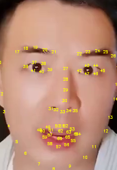

## Why is there a "bbox_shift" parameter?
When processing training data, we utilize the combination of face detection results (bbox) and facial landmarks to determine the region of the head segmentation box. Specifically, we use the upper bound of the bbox as the upper boundary of the segmentation box, the maximum y value of the facial landmarks coordinates as the lower boundary of the segmentation box, and the minimum and maximum x values of the landmarks coordinates as the left and right boundaries of the segmentation box. By processing the dataset in this way, we can ensure the integrity of the face.

However, we have observed that the masked ratio on the face varies across different images due to the varying face shapes of subjects. Furthermore, we found that the upper-bound of the mask mainly lies close to the 27th, 28th and 30th landmark points (as shown in Fig.1), which correspond to proportions of 15%, 63%, and 22% in the dataset, respectively.

During the inference process, we discovered that as the upper-bound of the mask gets closer to the mouth (30th), the audio features contribute more to lip motion. Conversely, as the upper-bound of the mask moves away from the mouth (28th), the audio features contribute more to generating details of facial disappearance. Hence, we define this characteristic as a parameter that can adjust the effect of generating mouth shapes, which users can adjust according to their needs in practical scenarios.



Fig.1. Facial landmarks
### Step 0.
Running with the default configuration to obtain the adjustable value range, and then re-run the script within this range. 
```
python -m scripts.inference --inference_config configs/inference/test.yaml 
```
```
********************************************bbox_shift parameter adjustment**********************************************************
Total frame:「838」 Manually adjust range : [ -9~9 ] , the current value: 0
*************************************************************************************************************************************
```
### Step 1.
re-run the script within the above range. 
```
python -m scripts.inference --inference_config configs/inference/test.yaml --bbox_shift xx  # where xx is in [-9, 9].
```
In our experimental observations, we found that positive values (moving towards the lower half) generally increase mouth openness, while negative values (moving towards the upper half) generally decrease mouth openness. However, it's important to note that this is not an absolute rule, and users may need to adjust the parameter according to their specific needs and the desired effect.